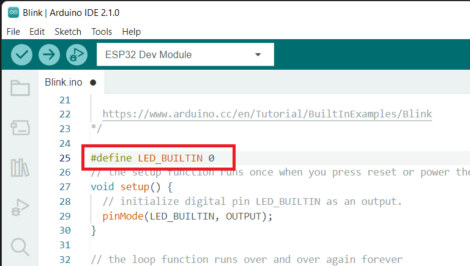
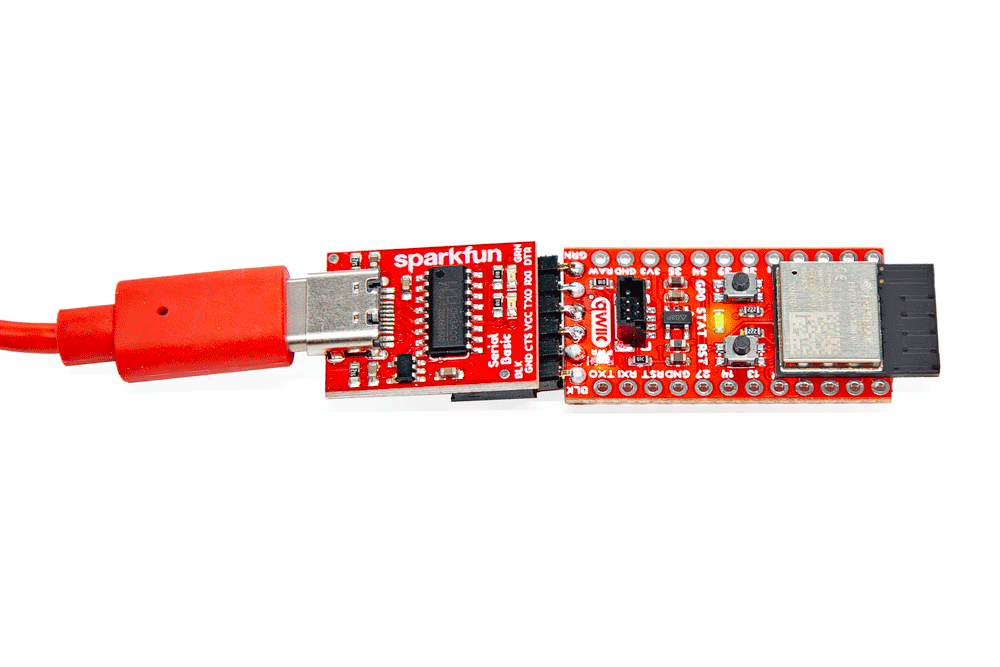

Now that we've installed the espressif boards package in Arduino, it's time to upload our first sketch to make sure everything is working properly.

### Example - Blink 

This basic example makes sure the board package installed correctly and the board accepts programming properly to blink the green STAT LED on the board every second. Open the example in Arduino by navigating to File > Examples > Basics > 01-Blink.

You will need to modify LED_BUILTIN to pin 0 like so: 

<figure markdown>
[{ width="400" }](assets/img/DefineLED_BUILTIN.png "Click to enlarge")
<figcaption markdown>Code changes for LED_BUILTIN</figcaption>
</figure>

Make sure you have the board (ESP32 Dev Board) and select your applicable COM port: 

<figure markdown>
[{ width="400" }](assets/img/BoardandPort.png "Click to enlarge")
<figcaption markdown>Board and Port selected</figcaption>
</figure>

### Uploading Code

!!! attention 
    While most ESP32 boards include an auto-reset and auto-bootload circuitry, these have been removed from the ESP32 Pro Mini to save space. This means you will need to manually enter and exit the bootloader mode every time new code is to be loaded.

Before uploading, you'll need to put the board into the <a href="https://docs.espressif.com/projects/esptool/en/latest/esp32/advanced-topics/boot-mode-selection.html#select-bootloader-mode">serial bootloader</a> with the <kbd>BOOT</kbd> button. Holding down the <kbd>BOOT</kbd> button, while connecting the board to a computer through its USB-C connector or resetting the board will cause the MCU to enter the <a href="https://docs.espressif.com/projects/esptool/en/latest/esp32/advanced-topics/boot-mode-selection.html#manual-bootloader">Firmware Download mode</a> and its serial bootloader. The board will remain in this mode until it is power cycled by either pressing the <kbd>RST</kbd> button or the board is unplugged/plugged in.

1. Hold the <kbd>BOOT</kbd> button down.
2. Reset the MCU. This can be accomplished by:
    * Plugging the board into a USB to Serial board.
    * Or, press and releasing the RST button while holding BOOT.
3. Release the <kbd>BOOT</kbd> button.
4. After programming is completed, reboot the MCU.
    * Press the <kbd>RST</kbd> button.
    * Power cycle the board. 

Once the board is in the serial bootloader, you can upload code through the Arduino interface. Once your code is uploaded, you will need to hit the <kbd>RST</kbd> button to get your sketch running. 

<figure markdown>
[{ width="400" }](assets/img/23386-ESP32-Qwiic-Pro-Mini-Gif.gif "Click to enlarge")
<figcaption markdown>Blink Example</figcaption>
</figure>
