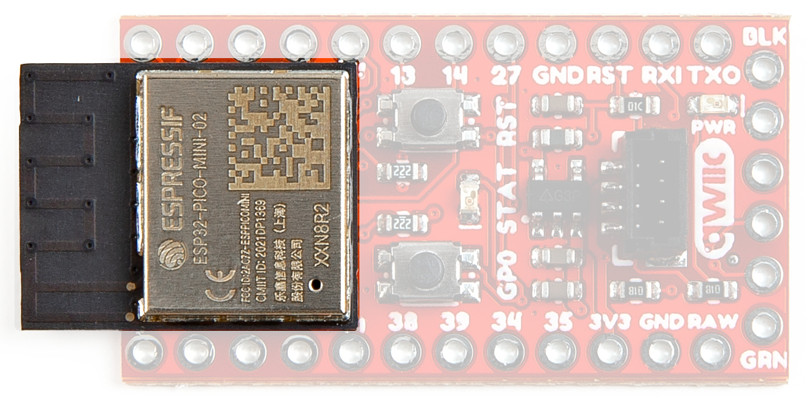
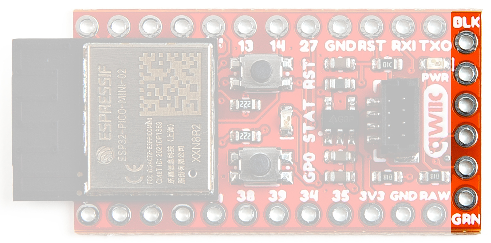
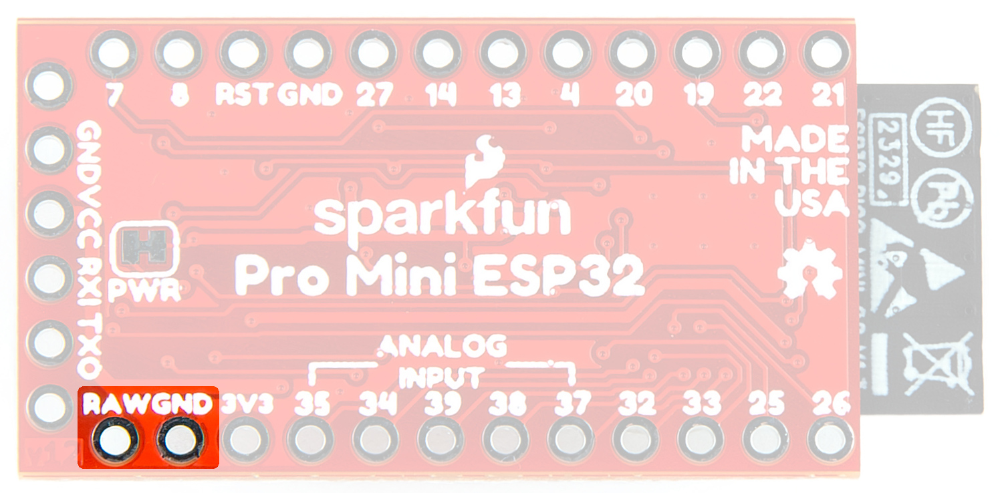
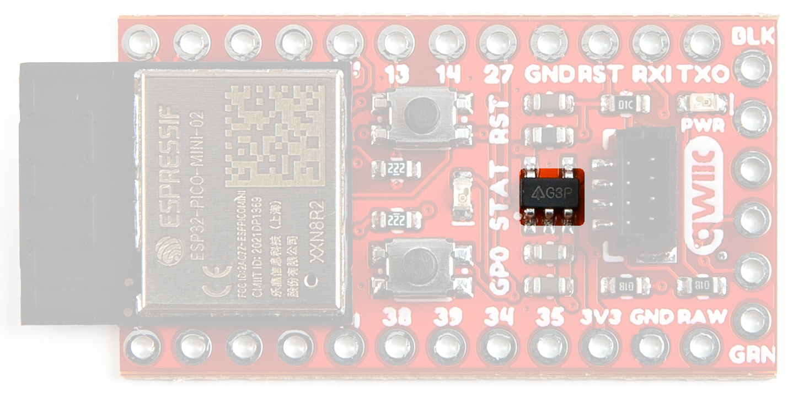
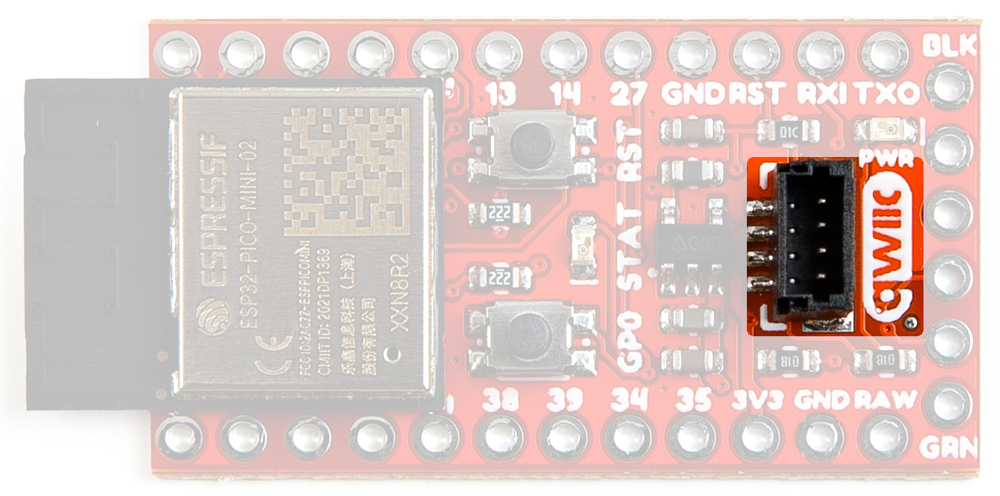
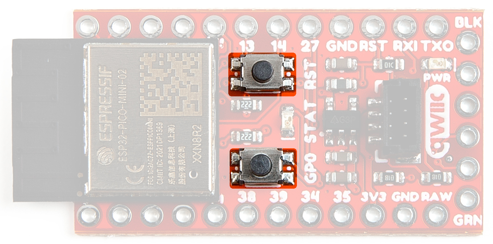
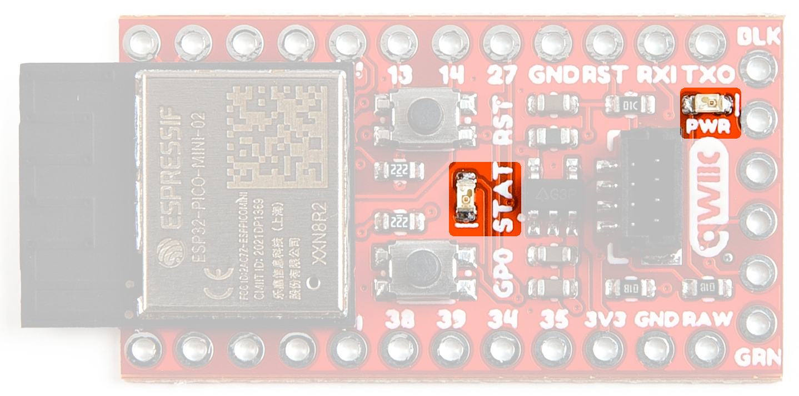
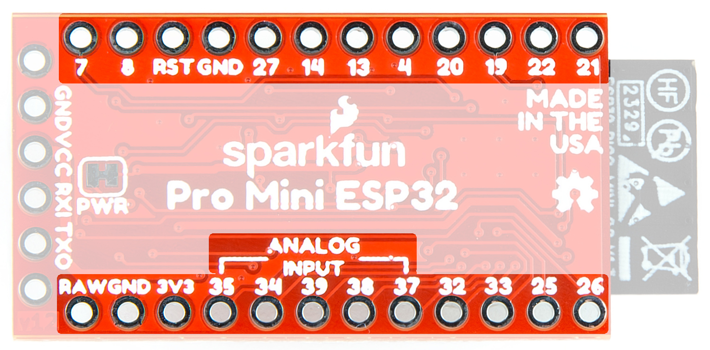
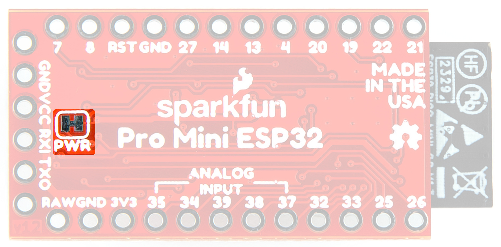
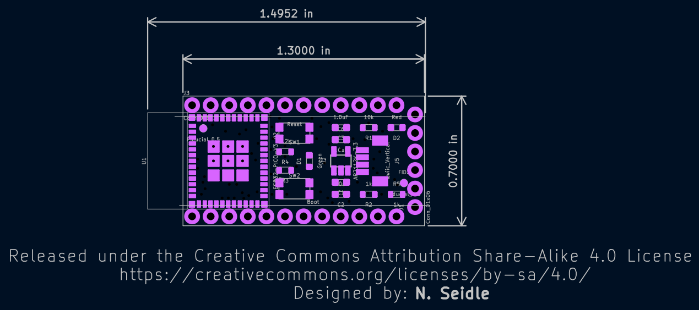

## ESP32 PICO Mini 

At the core of ESP32 PICO MINI 02 is the ESP32-PICO-V3-02 sip*. There are two CPU cores that can be individually controlled, and the CPU clock frequency is adjustable from 80 MHz to 240 MHz. The chip also has a low-power coprocessor that can be used instead of the CPU to save power while performing tasks that do not require much computing power, such as monitoring of peripherals. For more information, refer to the [datasheet](assets/board_files/Espressif_Systems_04082021_ESP32_PICO_MINI_02_N8R2-2295871.pdf). 

<figure markdown>
[{ width="400" }](assets/img/23386-Pro-Mini-ESP32-ESP32Pico.jpg "Click to enlarge")
<figcaption markdown>ESP32 PICO Mini</figcaption>
</figure>

## Power

Power can be provided via the PTH pins or via the FTDI pins at the edge of the board. To utilize the PTH pins, we recommend soldering the [JST Right-Angle Connector - Through-Hole 2-Pin](https://www.sparkfun.com/products/9749). Should you wish to go the FTDI route, we recommend [this one](https://www.sparkfun.com/products/15096). For the record, an FTDI will be required to program the board as well. 

<figure markdown>
[{ width="400" }](assets/img/23386-Pro-Mini-ESP32-FTDIPTH.jpg "Click to enlarge")
<figcaption markdown>FTDI Plated Through Holes</figcaption>
</figure>

<figure markdown>
[{ width="400" }](assets/img/23386-Pro-Mini-ESP32-PowerPins.jpg "Click to enlarge")
<figcaption markdown>Power Plated Through Holes</figcaption>
</figure>

## Voltage Regulator - AP2112K

The AP2112K Voltage Regulator ensures that the appropriate voltage is provided to the various components of the board. 

<figure markdown>
[{ width="400" }](assets/img/23386-Pro-Mini-ESP32-VoltageReg.jpg "Click to enlarge")
<figcaption markdown>Voltage Regulator - AP2112K</figcaption>
</figure>

## Qwiic connector

The board includes a Qwiic connector for use with our vast array of Qwiic sensors. The I2C data and clock lines are tied to 2.2kΩ pull-up resistors.

Note that we've mounted the Qwiic connector vertically to prevent the occlusion of soldering and/or using the GPIO. 

<figure markdown>
[{ width="400" }](assets/img/23386-Pro-Mini-ESP32-QwiicConnex.jpg "Click to enlarge")
<figcaption markdown>Qwiic connector</figcaption>
</figure>

## Buttons

There are two buttons on the board - Reset and Boot. The reset (RST) button allows users to reset the program running on the module without unplugging the board. The Boot Button allows the user to manually put the board into Bootloader Mode. To enter bootloader, hold the Boot button down when the ESP32 resets or powers on. These buttons are intentionally next to each other to make it a single finger rolling movement.

<figure markdown>
[{ width="400" }](assets/img/23386-Pro-Mini-ESP32-Buttons.jpg "Click to enlarge")
<figcaption markdown>Buttons</figcaption>
</figure>

## LEDs

Two LEDs - Power(Red) and STAT(Blue) - show the user that power has been appropriately supplied to the board and the status of the data transfer. 

<figure markdown>
[{ width="400" }](assets/img/23386-Pro-Mini-ESP32-LEDs.jpg "Click to enlarge")
<figcaption markdown>Power and Status LEDs</figcaption>
</figure>

## GPIO

The PTH pins are compatible with older Pro Minis. There are a few analog *input only* pins. They are labeled clearly.

<!--Use boot control pins with caution: 0, 2, 5, 12, 15
IO0: Avoid device connections. Can be used as a stat LED
IO2: Avoid external pullups - will cause bootloader fail
IO5: SDIO peripheral control. Has builtin pullup at POR
IO12: Avoid external pullups - will cause bootloader fail
IO15: Suppress output at POR. Has builtin pullup at POR
-->

<figure markdown>
[{ width="400" }](assets/img/23386-Pro-Mini-ESP32-GPIO.jpg "Click to enlarge")
<figcaption markdown>GPIO</figcaption>
</figure>

## Jumpers

??? note "Never modified a jumper before?"
	Check out our <a href="https://learn.sparkfun.com/tutorials/664">Jumper Pads and PCB Traces tutorial</a> for a quick introduction!
	

		<a href="https://learn.sparkfun.com/tutorials/664">
		 
        How to Work with Jumper Pads and PCB Traces</a>
	

### Power Jumper

If you have concerns about power consumption or really just don't like LEDs, you can cut this jumper to disable the red PWR LED on the front of the board.

<figure markdown>
[{ width="400" }](assets/img/23386-Pro-Mini-ESP32-PWRJumper.jpg "Click to enlarge")
<figcaption markdown>Power Jumper</figcaption>
</figure>

## Board Dimensions

The board dimensions are illustrated in the drawing below; the listed measurements are in inches.

<figure markdown>
[{ width="600" }](assets/board_files/SparkFun_ESP32_Qwiic_Pro_Mini_BoardDimensions.png "Click to enlarge")
<figcaption markdown>ESP32 Qwiic Pro Mini Board Dimensions</figcaption>
</figure>

??? tip "Need more measurements?"
	For more information about the board's dimensions, users can download the [KiCad files](assets/board_files/SparkFun_ESP32_Qwiic_Pro_Mini-KiCadFiles.zip) for the board. These files can be opened in Eagle and additional measurements can be made with the dimensions tool.

	??? info ":octicons-download-16:{ .heart } KiCAD - Free Download!"
		KiCAD is a [CAD]("computer-aided design") program for electronics that is free to use for hobbyists and students. However, it does require an account registration to utilize the software.

		

		[Download from :autodesk-primary:{ .autodesk }](https://www.kicad.org/download/ "Go to downloads page"){ .md-button .md-button--primary width="250px" }
		

	
		