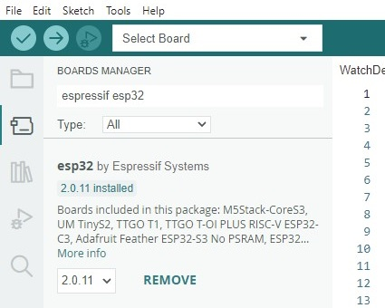

With the ESP32 Qwiic Pro Mini Board connected to our computer, it's time to set up the boards package in Arduino.

!!! attention
	If this is your first time using Arduino, please read through our tutorial on [installing the Arduino IDE](https://learn.sparkfun.com/tutorials/installing-arduino-ide). If you have not installed an Arduino library before, we recommend you check out our [installation guide](https://learn.sparkfun.com/tutorials/installing-an-arduino-library).

## Installing espressif Arduino Boards

Install the espressif ESP32 Arduino Boards package by opening the Boards Manager tab on the left side of the IDE, then search for "espressif ESP32" and install the latest version of the ESP32 boards package as the screenshot below shows. This assumes the use of Arduino 2.x. Legacy users (Arduino 1.8x and previous) can find the Boards Manager tool in File/Tools/Boards Manager.

<figure markdown>
[{ width="90%"}](assets/img/espressif_arduino_boards.jpg "Click to enlarge")
</figure>

    
<b>Note:</b> For more instructions, users can follow this tutorial on <a href="https://docs.arduino.cc/learn/starting-guide/cores">Installing Additional Cores</a> provided by Arduino. Users will also need the <code>.json</code> file for the Espressif Arduino core:

    
    

        <a href="https://raw.githubusercontent.com/espressif/arduino-esp32/gh-pages/package_esp32_index.json"><code>https://raw.githubusercontent.com/espressif/arduino-esp32/gh-pages/package_esp32_index.json</code></a>
    

